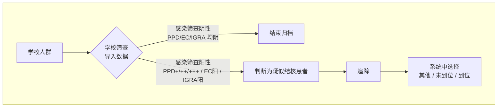
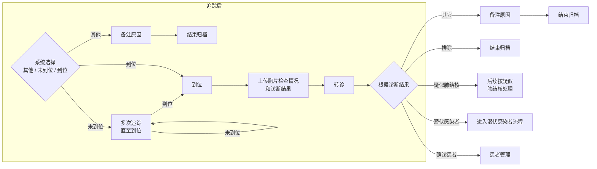
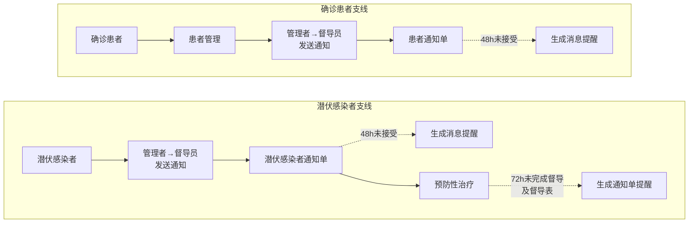
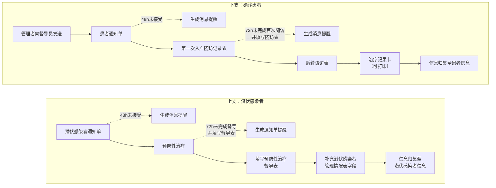
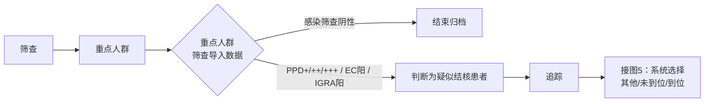
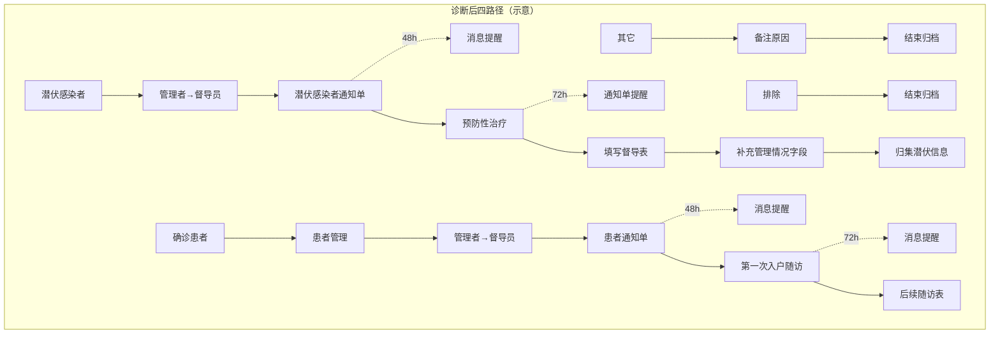
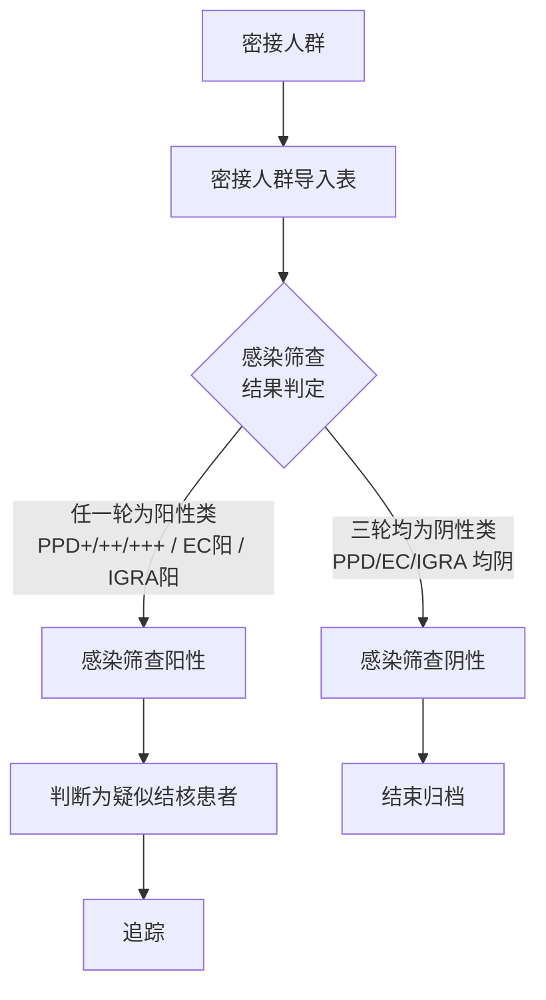
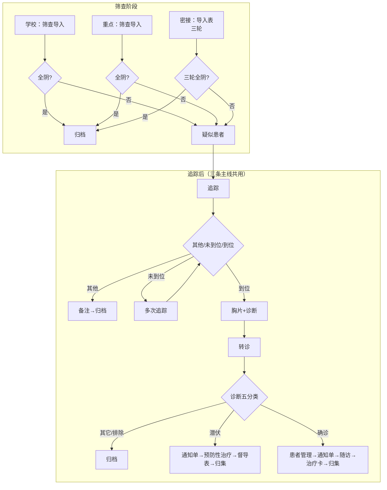

# 结核病筛查流程图识别说明（Typora / Mermaid）

> **在 Typora 中查看**：请确保「偏好设置 → Markdown → Markdown 扩展语法」中已勾选 **「图表（Diagram）」**，或使用支持 Mermaid 的预览。下文流程图均使用 `mermaid` 代码块，可在 Typora 中直接渲染。

本文档按 **1·2·3（学校）**、**4·5·6·7（重点人群）**、**8·9·10·11（密接人群）** 组织；**图 2、5、9** 与 **图 6、10** 在三条主线间**逻辑共用**，仅入口不同。

---

## 一、学校人群（图 1、2、3）

### 图 1 — 筛查入口与分流

### 图 2 — 追踪 → 胸片 → 转诊 → 诊断分流

（重点人群图 5、密接图 9 与此**同构**。）

> 原图中「疑似肺结核」与转诊后其它分支的衔接以贵方定稿为准；上图为保持五分类完整而单列节点。

### 图 2（续）— 潜伏感染者 / 确诊患者 支线概要

> 不同截图对「二级 / 三级管理者」表述不一致，图中统一写为「管理者」。

### 图 3 — 潜伏与确诊两条主流程（并行）

---

## 二、重点人群（图 4、5、6、7）

### 图 4 — 筛查入口与分流

### 图 5 — 与学校图 2 相同段落

见上文 **「图 2 — 追踪 → 胸片 → 转诊 → 诊断分流」**。

### 图 6 — 转诊后四种结局并列

> 部分原图将确诊支线写为「二级管理者」发送患者通知单，与上表「管理者」统一为可配置角色。

### 图 7 — 与图 3 同类（局部放大）

见上文 **「图 3 — 潜伏与确诊两条主流程」**。

---

## 三、密接人群（图 8、9、10、11）

### 图 8 — 三轮筛查与阴阳分流

（阳性三种情形：**首次阳** / **首阴半年后阳** / **首阴+半年阴+一年阳**；阴性情形：**首阴** / **首阴+半年阴** / **三轮均阴**。）

### 图 9 — 追踪阶段（与学校图 2、重点图 5 相同）

见上文 **「图 2 — 追踪 → 胸片 → 转诊 → 诊断分流」**。

### 图 10 — 四种结局（与图 6 同构）

见上文 **「图 6 — 转诊后四种结局并列」**。

### 图 11 — 与图 3、7 同类

见上文 **「图 3 — 潜伏与确诊两条主流程」**。

---

## 四、总览：跨人群共性（一张总图）

---

## 五、截图文件与编号对应

| 约定编号 | 参考文件（工作区 assets） |
|----------|---------------------------|
| 1 | `CleanShot_2026-04-15_at_12.50.02-...png` |
| 2 | `CleanShot_2026-04-15_at_12.51.06-...png` |
| 3 | `CleanShot_2026-04-15_at_12.51.24-...png` |
| 4 | `CleanShot_2026-04-15_at_12.51.38-...png` |
| 5 | `CleanShot_2026-04-15_at_12.51.49-...png` |
| 6 | `CleanShot_2026-04-15_at_12.52.07-...png` |
| 7 | `CleanShot_2026-04-15_at_12.52.17-...png` |
| 8 | `CleanShot_2026-04-15_at_12.52.31-...png` |
| 9 | `CleanShot_2026-04-15_at_12.52.42-...png` |
| 10 | `CleanShot_2026-04-15_at_12.52.54-...png` |
| 11 | `CleanShot_2026-04-15_at_12.53.07-...png` |

---

## 六、Typora 说明与排错

| 项目 | 说明 |
|------|------|
| 语法 | 使用 **Mermaid**（`flowchart LR/TB` + `subgraph`） |
| 中文 | 节点文案放在 `["..."]` 或 `{"..."}` 内；换行用 ` ` |
| 虚线提醒 | `-.->` 表示超时提醒等旁路逻辑 |
| 不渲染 | 检查是否开启图表扩展；或升级 Typora 版本 |

*若贵方定稿流程与图中「疑似肺结核分支」「二级/三级管理者」不一致，只需改对应 Mermaid 块即可。*
