# 结核病筛查追踪管理系统 — 程序使用手册

> 阅读顺序建议：先读 **第 1~5 章** 了解系统能做什么、怎么用，再按日常工作需要查阅 **第 6 章** 各功能操作说明，最后用 **第 7 章** 理解各功能之间如何衔接。**第 9 章部署**仅供技术人员参考，日常使用人员可跳过。
>

---

## 目录

- [1. 系统概述](#1-系统概述)
  - [1.1 系统是做什么的](#11-系统是做什么的)
  - [1.2 系统由哪些部分组成](#12-系统由哪些部分组成)
  - [1.3 系统总览图](#13-系统总览图)
- [2. 核心概念与术语（基础必读）](#2-核心概念与术语基础必读)
  - [2.1 数据来源（人群分类）](#21-数据来源人群分类)
  - [2.2 感染筛查与"阳性五项"](#22-感染筛查与阳性五项)
  - [2.3 追踪状态](#23-追踪状态)
  - [2.4 诊断结果与"分流"](#24-诊断结果与分流)
  - [2.5 通知单与督导表](#25-通知单与督导表)
  - [2.6 归档与历史患者](#26-归档与历史患者)
- [3. 快速上手](#3-快速上手)
  - [3.1 登录系统](#31-登录系统)
  - [3.2 界面布局](#32-界面布局)
  - [3.3 一级菜单总览](#33-一级菜单总览)
- [4. 用户角色与权限体系](#4-用户角色与权限体系)
  - [4.1 角色层级](#41-角色层级)
  - [4.2 谁能看到什么、能做什么](#42-谁能看到什么能做什么)
  - [4.3 数据隔离](#43-数据隔离)
- [5. 业务主流程总览（理解功能联系的总纲）](#5-业务主流程总览理解功能联系的总纲)
- [6. 功能模块详解（由浅入深）](#6-功能模块详解由浅入深)
  - [6.1 首页 / 工作台](#61-首页--工作台)
  - [6.2 筛查管理](#62-筛查管理)
  - [6.3 待诊断与诊断分流（筛查管理子流程）](#63-待诊断与诊断分流筛查管理子流程)
  - [6.4 潜伏感染者管理](#64-潜伏感染者管理)
  - [6.5 患者管理](#65-患者管理)
  - [6.6 密接人群管理](#66-密接人群管理)
  - [6.7 推介追踪管理](#67-推介追踪管理)
  - [6.8 系统消息](#68-系统消息)
  - [6.9 统计分析](#69-统计分析)
  - [6.10 数据清洗](#610-数据清洗)
  - [6.11 筛查问卷（公开填写）](#611-筛查问卷公开填写)
  - [6.12 系统管理](#612-系统管理)
- [7. 功能之间的关联关系](#7-功能之间的关联关系)
- [8. 附录](#8-附录)
  - [8.1 常用状态说明](#81-常用状态说明)
  - [8.2 自动提醒规则](#82-自动提醒规则)
  - [8.3 操作日志记录范围](#83-操作日志记录范围)
- [9. 项目部署](#9-项目部署)
  - [9.1 部署架构与组件](#91-部署架构与组件)
  - [9.2 方式一：Docker Compose 一键部署（推荐）](#92-方式一docker-compose-一键部署推荐)
  - [9.3 方式二：手动部署](#93-方式二手动部署)
  - [9.4 关键配置项说明](#94-关键配置项说明)
  - [9.5 升级、备份与常见问题](#95-升级备份与常见问题)

---

## 1. 系统概述

### 1.1 系统是做什么的

本系统是一套面向 **结核病（肺结核）防控** 的 **筛查—追踪—诊断—管理** 全流程数字化平台。它把线下"发现疑似病例 → 追踪到人 → 检查诊断 → 分类管理（潜伏感染者 / 确诊患者）→ 治疗随访 → 结案归档"的工作搬到线上，并贯穿多级机构（市级 → 区县 → 社区）协同。

一句话理解全局：

> **不同来源的人群数据进入系统 → 经过"筛查/追踪/诊断" → 被分流为"潜伏感染者"或"确诊患者" → 分别进入对应的管理流程（通知单、随访、督导、服药）→ 治疗结束后归档。** 整个过程辅以消息提醒、转诊/推介协同、统计导出与操作记录。

系统服务的典型角色：

- **区县/社区疾控与医疗机构操作员**：导入筛查数据、追踪对象、录入诊断、填写随访/督导表、登记服药。
- **接收机构（基层单位）**：接收上级下发的通知单/转诊/推介并确认。
- **管理员**：用户/部门/权限维护、数据备份、操作日志审计、统计导出。

### 1.2 系统由哪些部分组成

从使用角度看，系统可以分成三块：

| 部分 | 您需要了解什么 |
|---|---|
| **电脑端操作界面** | 日常登录后使用的网页，左侧是菜单，中间是各功能页面 |
| **业务数据** | 筛查记录、患者信息、通知单、随访表等，都保存在系统数据库中 |
| **消息与提醒** | 通知单待接收、超时未处理等事项，会通过"系统消息"和弹窗提醒您 |

菜单按**工作阶段**划分（筛查 → 潜伏/患者管理 → 统计等），同一张列表里会用**彩色标签**标明数据来自哪类人群（学生、重点、疫情、密接等），方便您一眼区分。

### 1.3 系统总览图

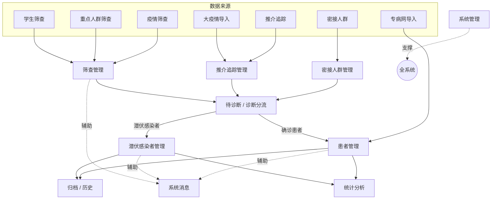
```mermaid
flowchart TB
  subgraph 数据来源
    A1[学生筛查]
    A2[重点人群筛查]
    A3[疫情筛查]
    A4[大疫情导入]
    A5[推介追踪]
    A6[密接人群]
    A7[专病网导入]
  end

  A1 & A2 & A3 --> SCR[筛查管理]
  A4 & A5 --> RT[推介追踪管理]
  A6 --> CC[密接人群管理]

  SCR --> SUS[待诊断 / 诊断分流]
  RT --> SUS
  CC --> SUS

  SUS -->|潜伏感染者| LAT[潜伏感染者管理]
  SUS -->|确诊患者| PAT[患者管理]
  A7 --> PAT

  LAT --> ARC[归档 / 历史]
  PAT --> ARC

  SCR -.辅助.-> MSG[系统消息]
  LAT -.辅助.-> MSG
  PAT -.辅助.-> MSG
  LAT & PAT --> STAT[统计分析]
  SYS[系统管理] -.支撑.-> ALL((全系统))
```

---

## 2. 核心概念与术语（基础必读）

> 本章是理解后续所有功能的"地基"。先看懂这几个概念，后面每个功能都会非常顺。

### 2.1 数据来源（人群分类）

系统把同一套"筛查→诊断→管理"流程复用给多种人群，列表中以**彩色标签**标明"数据来源"：

| 标签显示 | 说明 |
|---|---|
| 学生筛查 | 学校学生/教职工新生体检筛查 |
| 重点人群 | 老年人、糖尿病、双感等重点人群筛查 |
| 疫情筛查 | 常规/疫情现场筛查 |
| 大疫情 | 大疫情报告卡导入（直接追踪和诊断，不经感染筛查阶段） |
| 推介 | 推介追踪模块中手动录入的对象 |
| 密接 | 密接人群（确诊患者会进入患者管理） |
| 专病网 | 专病/病案信息表导入的患者 |

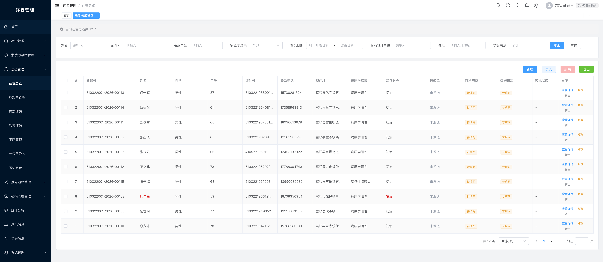

### 2.2 感染筛查与"阳性五项"

筛查阶段会做**感染筛查检测**（PPD 皮试 / EC 皮试 / IGRA 血检）。系统在导入时根据"感染筛查结果"自动判定是否为**潜伏疑似对象**：

> **阳性五项（命中任一即判为疑似对象）**：PPD+、PPD++、PPD+++、EC阳性、IGRA阳性

- 命中阳性 → **自动进入"待诊断"列表**，等待工作人员追踪和诊断。
- 全部阴性 → **直接归档**（结束，无需后续处理）。

> 导入 Excel 时系统会自动完成上述判定，无需人工勾选。

### 2.3 追踪状态

对"待诊断"对象需要**追踪到人**才能进一步检查。追踪状态包括：

| 状态 | 说明 |
|---|---|
| 待追踪 | 尚未发起追踪 |
| 到位 | 已联系到对象，可进行胸片检查和诊断 |
| 未到位 | 本次未联系到，需再次追踪 |
| 其他 | 特殊情况，需备注原因后归档 |
| 强制结束 | **未到位累计 3 次后自动结束并归档** |

> 规则要点：未到位最多 3 次，第 3 次后系统自动"强制结束"并归档；选"其他"必须填写备注原因。

### 2.4 诊断结果与"分流"

追踪到位后录入胸片、再录入**确认诊断**，诊断结果决定这条记录"去哪里"——这就是**分流**：

| 诊断结果 | 流向 |
|---|---|
| 排除 | 归档（结束） |
| 疑似肺结核 | 保留在待诊断列表继续处理 |
| **潜伏感染者** | 进入 **潜伏感染者管理** |
| **确诊患者** | 进入 **患者管理** |
| 其他 | 备注原因后归档 |

> "分流"是整个系统的枢纽：它把"筛查/追踪"阶段和"潜伏/患者管理"阶段连接起来。

### 2.5 通知单与督导表

进入潜伏/患者管理后，上级机构向基层机构**下发通知单**，基层确认后开展后续工作：

- **通知单**：分"潜伏感染者通知单"和"患者通知单"。状态依次为：**未发送 → 草稿 → 已发送 → 已确认**。
- **督导表**：仅潜伏感染者使用，记录预防性治疗的督导过程。
- **超时提醒**：通知单发送后 **48 小时**未确认、督导表确认后 **72 小时**未填写，系统会自动发消息提醒您（详见 [8.2](#82-自动提醒规则)）。

### 2.6 归档与历史患者

业务流程走完（排除、治愈、停止治疗、强制结束等）后，记录会被**归档**，从"在管"列表移入"历史患者"列表，不再占用日常工作视图，但仍可查询、导出，必要时可"解锁"恢复。

---

## 3. 快速上手

### 3.1 登录系统

1. 在浏览器中打开系统网址，进入登录页（页面标题为"筛查管理"）。
2. 输入**用户名**与**密码**（密码长度为 6~16 位），按回车或点击"登录"。
3. 登录成功后自动进入**首页/工作台**。
4. 左侧菜单会根据您的**角色和权限**显示，没有权限的菜单不会出现。

> 登录失败或长时间未操作导致会话过期时，系统会自动退回登录页，重新登录即可。

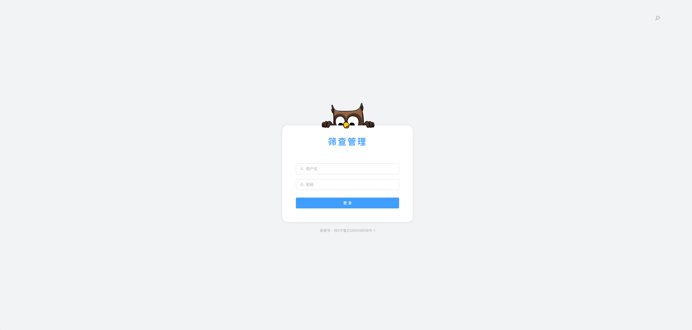

### 3.2 界面布局

典型后台三段式布局：

- **左侧菜单**：一级、二级菜单，按您的权限显示可访问的功能。
- **顶部导航栏**：当前位置提示、全屏、主题切换、消息提醒（未读数字角标）、用户头像与退出登录。
- **主内容区**：各功能页面，通常包含筛选条件、数据表格、操作按钮和翻页。
- **页签栏**：已打开过的页面会以标签形式保留，方便来回切换。

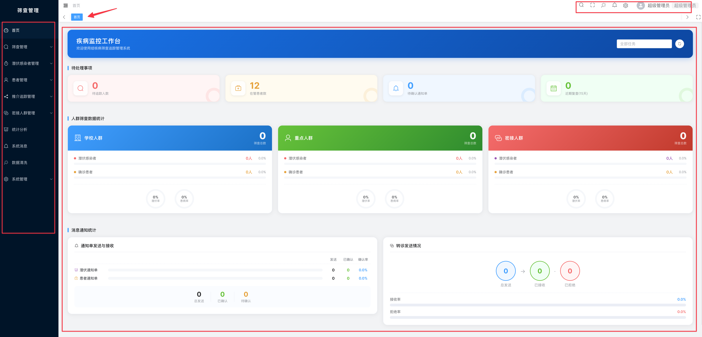

### 3.3 一级菜单总览

| 菜单 | 作用（一句话） |
|---|---|
| 首页 | 工作台，待办与统计概览 |
| 筛查管理 | 导入筛查数据、追踪、诊断分流 |
| 潜伏感染者管理 | 潜伏者的通知单、督导表、归档 |
| 患者管理 | 确诊患者的通知单、随访、服药、归档 |
| 密接人群管理 | 密接个案、三轮筛查、监测随访 |
| 推介追踪管理 | 跨单位推介 + 主动追踪诊断 |
| 统计分析 | 各类统计报表与信息总表导出 |
| 系统消息 | 通知单/转诊/推介的消息中心 |
| 数据清洗 | 导入模板下载 + 数据校验清洗 |
| 系统管理 | 用户/部门/权限/备份/操作日志 |

> 此外还有一个**不在左侧菜单中**的公开页面：**筛查问卷**（无需登录，扫码或打开链接即可填写）。

---

## 4. 用户角色与权限体系

### 4.1 角色层级

系统设有 **超级管理员** 和 **一至五级用户**，层级越高，管辖范围越大：

| 角色 | 典型职责 |
|---|---|
| 超级管理员 | 拥有全部权限，负责用户、部门、备份等系统级管理 |
| 一级 | 市级/最高业务层级 |
| 二级 | 区县级管理 |
| 三级 | 区县/机构级，常作为**通知单、转诊、推介的发起方** |
| 四级 | 机构级，可作为推介接收方 |
| 五级 | 基层社区机构，常作为**通知单、转诊的接收确认方**，以及随访、督导表的填写方 |

> 日常工作中常说的"三/四级用户"指推介接收方；"五级机构"指基层接收单位。

### 4.2 谁能看到什么、能做什么

系统通过**权限配置**控制每个人能看到哪些菜单、能点击哪些按钮：

1. **菜单权限**：没有权限的菜单不会出现在左侧；强行访问无权限页面会提示无权操作。
2. **按钮权限**：同一页面上，不同用户看到的操作按钮可能不同。例如：有人只能"查看"，有人可以"追踪""录入诊断""删除"等。

权限由管理员在 **系统管理 → 权限管理** 中配置，分为"按角色统一分配"和"给个别用户额外开通"两种方式。配置变更后，用户需**重新登录**才能生效。

### 4.3 数据隔离

不同区县、不同机构之间的数据相互隔离：上级可以看到下辖区域的数据，同级区县之间互不可见。您录入的筛查记录会自动归属到您所在的机构。

---

## 5. 业务主流程总览（理解功能联系的总纲）

下图是**贯穿全系统的主干流程**，后续每个功能都是这张图上的一个环节。建议反复对照本图阅读第 6 章。

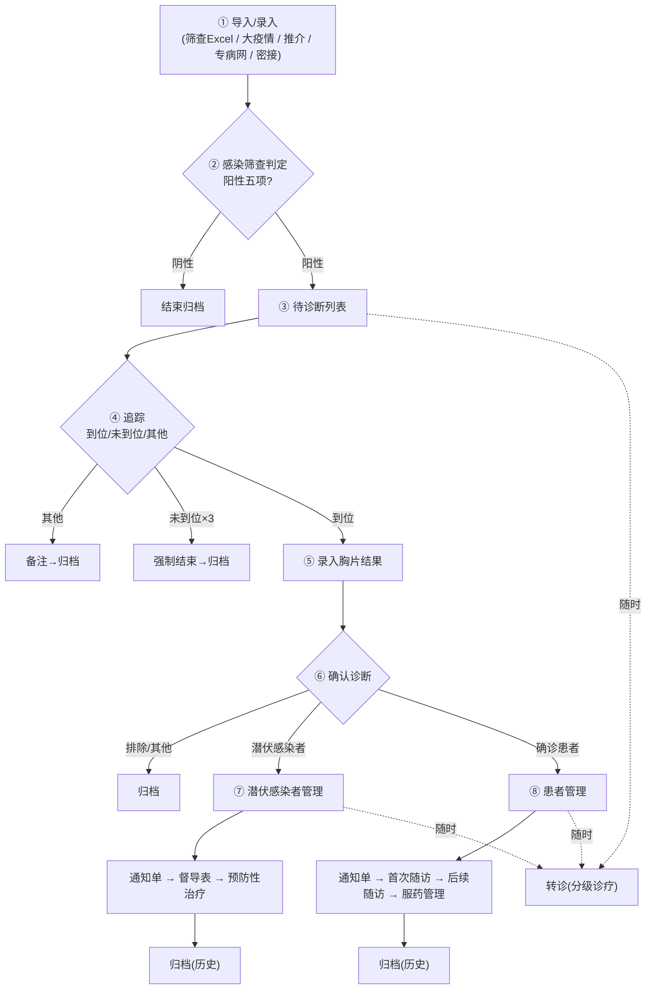
```mermaid
flowchart TD
  IMP["① 导入/录入<br/>(筛查Excel / 大疫情 / 推介 / 专病网 / 密接)"] --> JUDGE{"② 感染筛查判定<br/>阳性五项?"}
  JUDGE -->|阴性| ARC1["结束归档"]
  JUDGE -->|阳性| SUS["③ 待诊断列表"]

  SUS --> TRK{"④ 追踪<br/>到位/未到位/其他"}
  TRK -->|其他| ARC2["备注→归档"]
  TRK -->|未到位×3| ARC3["强制结束→归档"]
  TRK -->|到位| XRAY["⑤ 录入胸片结果"]
  XRAY --> DIAG{"⑥ 确认诊断"}

  DIAG -->|排除/其他| ARC4["归档"]
  DIAG -->|潜伏感染者| LAT["⑦ 潜伏感染者管理"]
  DIAG -->|确诊患者| PAT["⑧ 患者管理"]

  LAT --> LN["通知单 → 督导表 → 预防性治疗"] --> LARC["归档(历史)"]
  PAT --> PN["通知单 → 首次随访 → 后续随访 → 服药管理"] --> PARC["归档(历史)"]

  SUS -.随时.-> REF["转诊(分级诊疗)"]
  LAT -.随时.-> REF
  PAT -.随时.-> REF
```

> **密接人群**是特例：它有自己的三轮独立筛查逻辑（见 [6.6](#66-密接人群管理)），但"确诊"后同样汇入 **患者管理**。
> **大疫情/推介**对象**跳过感染筛查阶段**，直接进入"追踪→诊断"。

---

## 6. 功能模块详解（由浅入深）

> 阅读约定：每个功能均按 **【它是做什么的】→【页面构成】→【操作步骤】→【与其它功能的衔接】** 讲解。

### 6.1 首页 / 工作台

**【做什么】** 登录后的第一屏，汇总"我的待办"和关键统计，让用户一眼看到要处理什么。页面根据角色不同展示两套界面。

**【普通用户工作台】** 标题"我的工作台"，4 张统计卡片：

| 卡片 | 含义 |
|---|---|
| 待追踪人数 | 待诊断中需要追踪的对象数 |
| 在管患者数 | 当前在管的确诊患者数 |
| 待确认通知单 | 需要我确认接收的通知单数 |
| 复查（15天内） | 近期需复查的人数 |

**【管理员工作台】** 标题"疾病监控工作台"，更丰富：

- 顶部可按**上传批次**筛选；
- **待处理事项**（同上 4 项）；
- **人群筛查数据统计**：学校/重点/密接三类卡片，各含筛查总数、潜伏感染者人数/比例（环形图）、确诊患者人数/比例（环形图）；
- **消息通知统计**：通知单发送/确认率、转诊发送/接收/拒绝率。

**【衔接】** 卡片数字是各业务模块的"入口指示器"，点击对应统计可引导到筛查/患者/消息等模块处理。

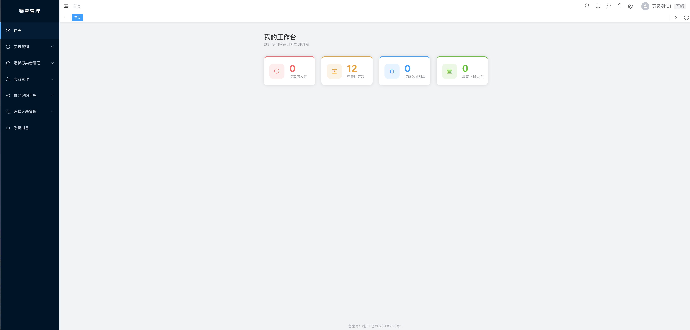
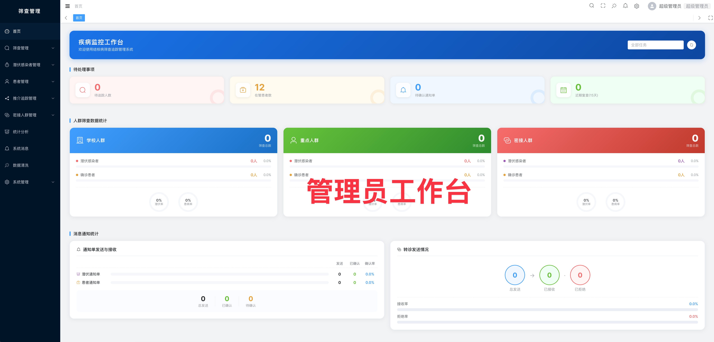

---

### 6.2 筛查管理

**【做什么】** 这是数据进入系统的**第一道门**。把线下采集的人群筛查 Excel 导入系统，自动判定潜伏疑似对象，并提供"筛查数据"与"待诊断"两个视图。

**筛查管理**下含 3 个子菜单，操作方式相同，仅针对的人群不同：

| 子菜单 | 针对人群 |
|---|---|
| 学生人群 | 学校学生/教职工筛查 |
| 重点人群 | 老年人、糖尿病等重点人群筛查 |
| 疫情筛查 | 常规/疫情现场筛查 |

**【页面构成 — 两个标签页】** 每个子菜单页顶部有两个标签（根据权限显示）：

- **筛查数据**：展示**全部**导入的筛查原始记录。
- **待诊断**：只展示感染筛查**阳性**的记录，是后续追踪和诊断的工作台。

#### 6.2.1 筛查数据视图

**布局**：筛选区（姓名、证件号、学校名称、辖区、电话、录入单位、时间段、是否潜伏、诊断结果）+ 工具栏（导入 Excel、导出、新增）+ 表格 + 分页。

**主要操作**：

| 操作 | 说明 |
|---|---|
| 导入 Excel | 上传筛查模板，系统自动识别阳性对象；导入完成后弹窗显示成功条数和错误明细 |
| 新增 / 编辑 | 手动维护单条筛查记录 |
| 删除 / 批量删除 | 删除该记录及其后续所有关联数据（请谨慎操作） |
| 导出 | 导出全部或勾选项为 Excel |
| 查看详情 | 查看筛查原始字段 |

> 确诊患者行以**红色背景**高亮提示。

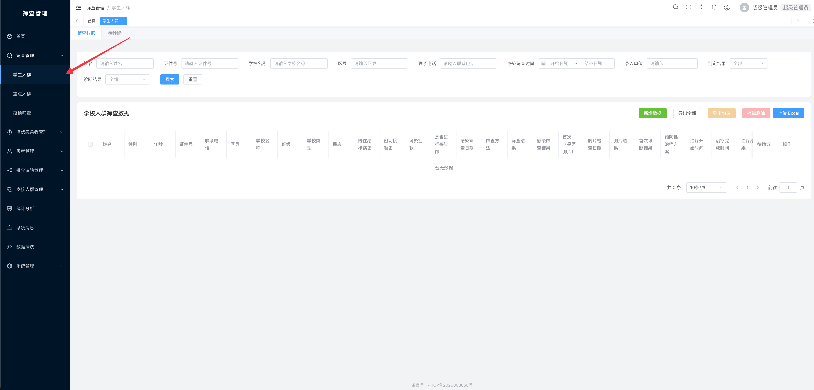
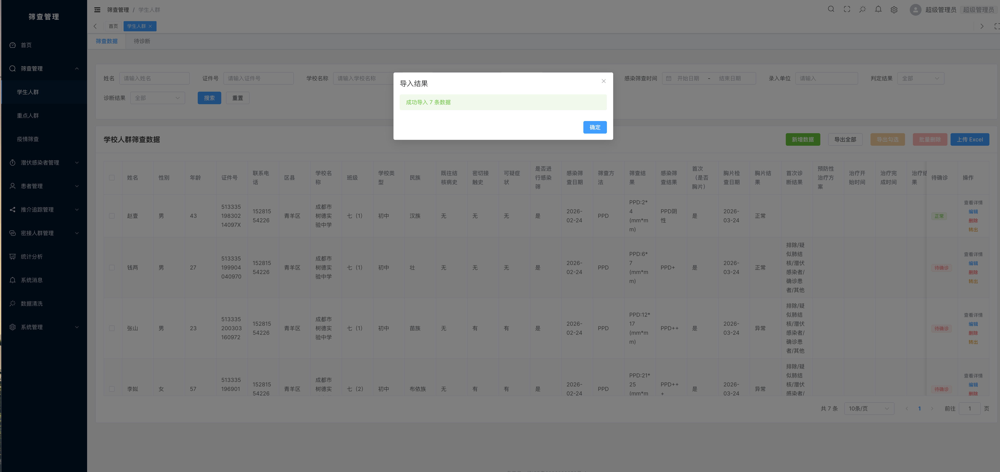

#### 6.2.2 待诊断视图

详见下一节 [6.3 待诊断与诊断分流](#63-待诊断与诊断分流筛查管理子流程)。

**【衔接】** 筛查数据导入 → 阳性自动进入"待诊断" → 诊断分流到潜伏/患者管理。导入模板可在"数据清洗"页下载（见 [6.10](#610-数据清洗)）。

---

### 6.3 待诊断与诊断分流（筛查管理子流程）

**【做什么】** 对感染筛查阳性的疑似对象，依次完成 **追踪 → 录入胸片 → 确认诊断**，最终把人**分流**到正确的去向。这是筛查阶段的核心工作台。

**【页面构成】** 筛选区（姓名、证件号、电话、时间段、追踪状态、归档状态、诊断结果）+ 表格（姓名、性别、年龄、证件号、电话、感染筛查结果、追踪状态、未到位次数、追踪备注、胸片结果、确认诊断、归档状态、操作）+ "批量导入胸片结果"按钮。

**【操作步骤（按业务顺序）】**

1. **追踪**：点击后弹窗选择 **到位 / 未到位 / 其他**。
   - 选"未到位"且已达 2 次 → 提示"最多 3 次后自动归档"，第 3 次自动强制结束。
   - 选"其他"或第 3 次未到位 → 需填写备注原因。
2. **录入胸片结果**（仅"到位"且尚未录入胸片时出现）：弹窗确认或修改"是否胸片、胸片日期、胸片结果（正常/异常/未查）"。系统会自动回填导入时的数据供您确认。
   - 也支持顶部"**批量导入胸片结果**"：上传 Excel 一次性更新多条记录。
3. **确认诊断**（"到位"且尚未完成诊断时出现）：弹窗选择 **确诊患者 / 排除 / 潜伏感染者**。
4. **转诊**：任意阶段可发起分级诊疗转诊（详见 [6.7 推介追踪管理](#67-推介追踪管理) 中关于"转诊"的说明）。

> 超期预警：追踪到位超过 7 天仍未录胸片的行会**标黄高亮**提醒。

**【诊断分流结果】**

| 选择 | 结果 |
|---|---|
| 确诊患者 | 该筛查记录结案标红；确诊患者数据进入**患者管理**口径 |
| 潜伏感染者 | 进入**潜伏感染者管理** |
| 排除 | 归档结束 |

**【衔接】** 这是连接"筛查"与"潜伏/患者管理"的**枢纽节点**。诊断为潜伏 → [6.4](#64-潜伏感染者管理)；诊断为确诊 → [6.5](#65-患者管理)。

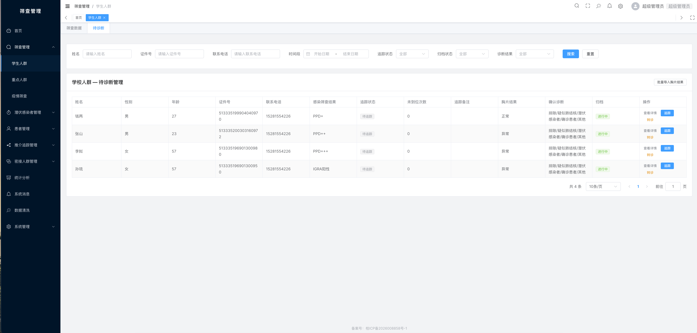
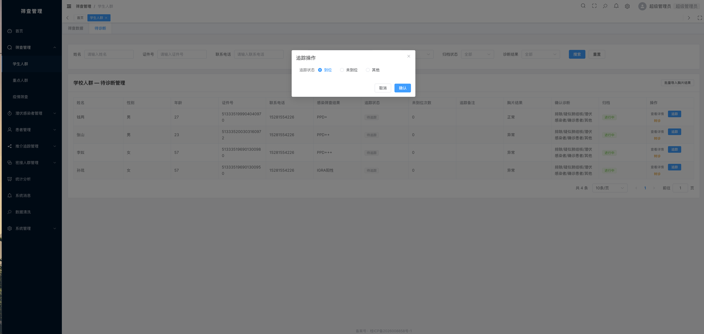
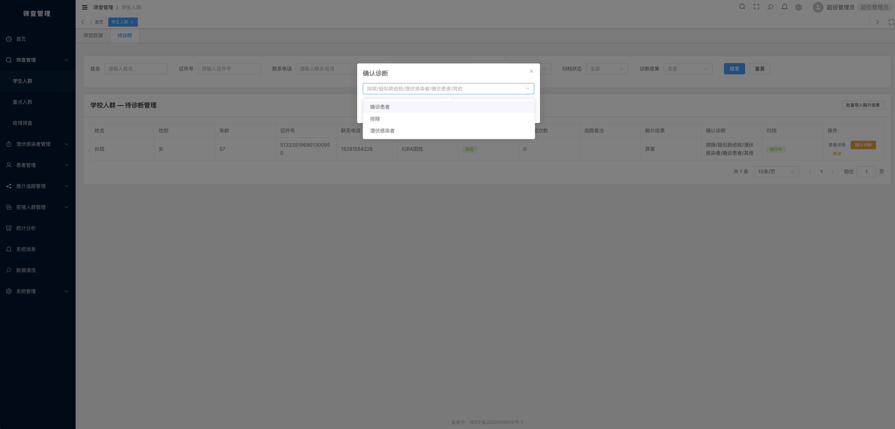

---

### 6.4 潜伏感染者管理

**【做什么】** 管理被诊断为"潜伏感染者"的人群（跨学生/重点/疫情/大疫情/推介多来源聚合，**不含密接**）：下发通知单、开展预防性治疗督导、记录督导表，最终归档。

**潜伏感染者管理**包含 4 个子菜单：

| 子菜单 | 作用 |
|---|---|
| 在管总览 | 潜伏者主数据维护（新增/导入/编辑/删除/转出/导出） |
| 通知单管理 | 填写并发送潜伏者通知单，接收方确认 |
| 督导表管理 | 填写预防性治疗督导表 |
| 历史患者 | 已归档潜伏者的查询与导出 |

#### 6.4.1 在管总览

**布局**：顶部"当前在管潜伏感染者共 N 人"提示；筛选（姓名、证件号、电话、时间段、数据来源、录入者）；工具栏（新增、导入、删除、导出）；表格（姓名、性别、年龄、证件号、电话、感染筛查结果、通知单状态、数据来源标签、转出状态、操作）。

**操作**：新增建档、Excel 导入、批量删除、导出"在管潜伏感染者信息总表"、查看详情、修改、**转出**（推送到其他机构）。

#### 6.4.2 通知单管理

**做什么**：向基层（五级机构）下发"潜伏感染者通知单"。

**操作**：

- **发送通知单 / 继续填写**：打开通知单表单弹窗（基本信息、感染检查、胸片检查、治疗方案【6H/9H、3HR、3HR/4R、母牛分枝杆菌、个体方案、不服药】、治疗机构、接收单位等），可"保存草稿"或"发送通知单"。
- **查看通知单**：已发送后查看详情，基层接收方（五级用户）可"确认接收"，支持打印。
- **转出 / 归档**：可转诊或直接结案归档至历史。

> 状态流转：**未发送 → 草稿 → 已发送 → 已确认**。发送后 48 小时未确认，系统会发超时提醒消息。

#### 6.4.3 督导表管理

**做什么**：记录潜伏感染者**预防性治疗**的督导过程（可多次督导）。

**督导表字段（要点）**：基本信息+类别、开始治疗时间、治疗方案、督导记录（时间/方式/内容，可多条）、全疗程规律治疗评价（中断用药/次数/用药率）、督导管理人员、备注、**附件上传**（图片/PDF）。支持保存草稿、提交、**归档**（归档同步预防性治疗信息回筛查表）。

> 通知单确认后 72h 未填督导表 → 触发超时消息。五级用户提交后 10 天内可修改。

#### 6.4.4 历史患者

已归档（停止治疗/规范完成等）潜伏者列表，可查看基本信息/通知单/督导表、批量删除、导出历史总表。

**【衔接】** 上游来自[待诊断诊断分流](#63-待诊断与诊断分流筛查管理子流程)（诊断=潜伏感染者）；流程：在管总览 → 通知单（发送+确认）→ 督导表（填写+归档）→ 历史患者。任意阶段可转出。

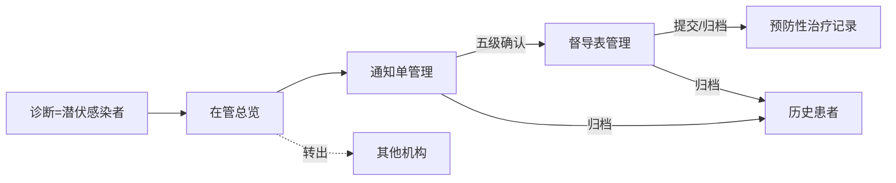
```mermaid
flowchart LR
  A[诊断=潜伏感染者] --> B[在管总览]
  B --> C[通知单管理]
  C -->|五级确认| D[督导表管理]
  D -->|提交/归档| E[预防性治疗记录]
  C -->|归档| F[历史患者]
  D -->|归档| F
  B -.转出.-> G[其他机构]
```

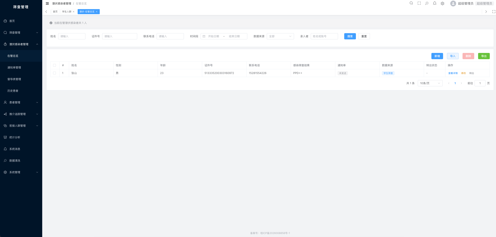
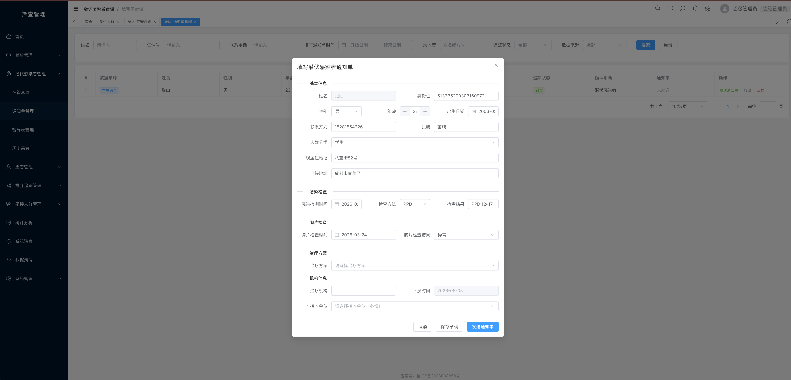
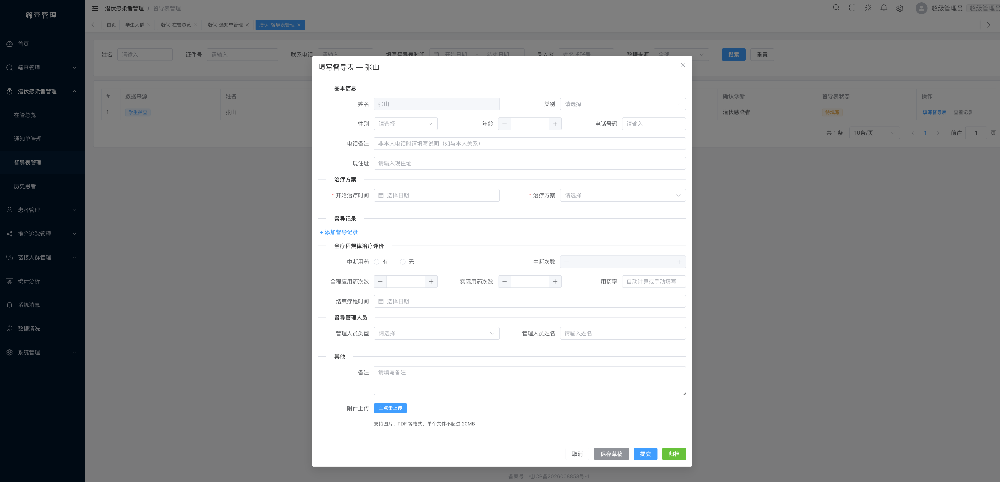

---

### 6.5 患者管理

**【做什么】** 管理被诊断为"确诊患者"的全部人群（聚合 6 类来源：学生/重点/疫情/大疫情/推介/密接 + 专病网导入）：下发患者通知单、入户随访、后续随访、服药管理与领药登记，治疗结束后归档。**按"每个功能一个独立子菜单"组织。**

**患者管理**包含 7 个子菜单：

| 子菜单 | 作用 |
|---|---|
| 在管总览 | 患者主数据维护 |
| 通知单管理 | 患者通知单下发与确认 |
| 首次随访 | 第一次入户随访记录 |
| 后续随访 | 后续随访服务记录（可多次） |
| 服药管理 | 每日服药记录 + 领药登记 |
| 专病网导入 | 上传专病表批量建患者 |
| 历史患者 | 已归档患者查询与导出 |

#### 6.5.1 在管总览

**布局**：统计"当前在管患者共 N 人"；筛选（姓名、证件号、电话、病原学结果、登记日期、服药管理单位、住址、数据来源含专病网）；工具栏（新增/导入/删除/导出）；表格（登记号、姓名【复治标红】、性别、年龄、证件号、电话、住址、病原学结果、治疗分类、通知单状态、首次随访状态、数据来源、转出状态、操作）。复治患者整行淡红高亮。

#### 6.5.2 通知单管理

下发"患者通知单"。表单含：基本信息、患者类型、管理方式（全程督导/强化督导/全程管理/未管理）、胸片检查、治疗方案（8 种 + 个体化）、病原学检查（痰涂片/培养/分子/病理）、治疗机构、服药管理单位、接收单位（五级，必填）。可保存草稿/发送/查看/确认接收/打印/转出/删除。

> 列表对**已发送超 72h 未确认**的行：背景淡红 + 发送时间红色加粗高亮。

#### 6.5.3 首次随访

**做什么**：填写"肺结核患者第一次入户随访记录表"。字段含编号、随访时间/方式、患者类型、痰菌/耐药情况、症状体征（多选）、化疗方案/用法/督导人员/药品剂型、居住环境（通风/吸烟/饮酒）、**健康教育 10 项（各选掌握/未掌握）**、下次随访时间、医生签名、备注、**图片附件（最多 6 张）**。已完成后可查看/打印；五级用户 10 天内可改。支持勾选导出。

#### 6.5.4 后续随访

**做什么**：按《后续随访服务记录表》模板填写，**可多次填写**（每次新增一行）。字段含随访时间/治疗月序/方式、症状体征、生活方式、用药（化疗方案/用法/剂型/漏服次数）、不良反应、并发症、转诊、处理意见、下次随访时间、**停止治疗（时间+原因）**、全程管理（应/实际访视与服药次数、服药率）、备注、**附件 2~6 张图片**。

> **归档触发**：后续随访中选"停止治疗=是"且原因非"转入耐多药治疗"→ 保存后患者**自动归档**到历史患者；选"转入耐多药治疗"可继续随访。

#### 6.5.5 服药管理

**做什么**：记录患者每日服药与领药情况。

- **服药管理弹窗**：月历控件点击标记每日服药（绿色✓）；管理方式、督导人员、治疗前痰菌检查；填写"停止完成时间"后点"**完成并归档**"→ 移入历史患者；可打印治疗记录卡。
- **填写领药**：新增领药记录（药品名称及用量【可多药】、数量+单位、领取时间、发药单位、备注）。"领药情况"列摘要展示领取次数与最近记录。

#### 6.5.6 专病网导入

单卡片上传页：上传专病/病案信息表 Excel，系统自动提取字段并创建患者记录（来源标签显示为"专病网"），随后按标准患者流程继续操作。

#### 6.5.7 历史患者

已归档患者列表，可只读查看通知单/随访/服药、批量删除、导出历史总表；因**"停止治疗"**而归档的患者，可点击"**解锁**"恢复在管，继续后续随访。

**【衔接】** 上游来自诊断分流（确诊）、密接确诊、推介确诊、专病网导入。标准路径：**通知单 → 首次随访 → 后续随访（多次）→ 服药管理 + 领药 → 归档**。

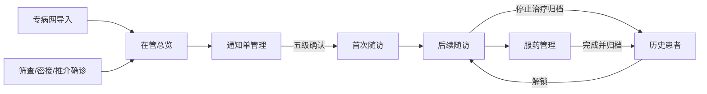
```mermaid
flowchart LR
  SD[专病网导入] --> OV[在管总览]
  SCR[筛查/密接/推介确诊] --> OV
  OV --> NT[通知单管理]
  NT -->|五级确认| FV[首次随访]
  FV --> FU[后续随访]
  FU --> MD[服药管理]
  FU -->|停止治疗归档| HI[历史患者]
  MD -->|完成并归档| HI
  HI -->|解锁| FU
```

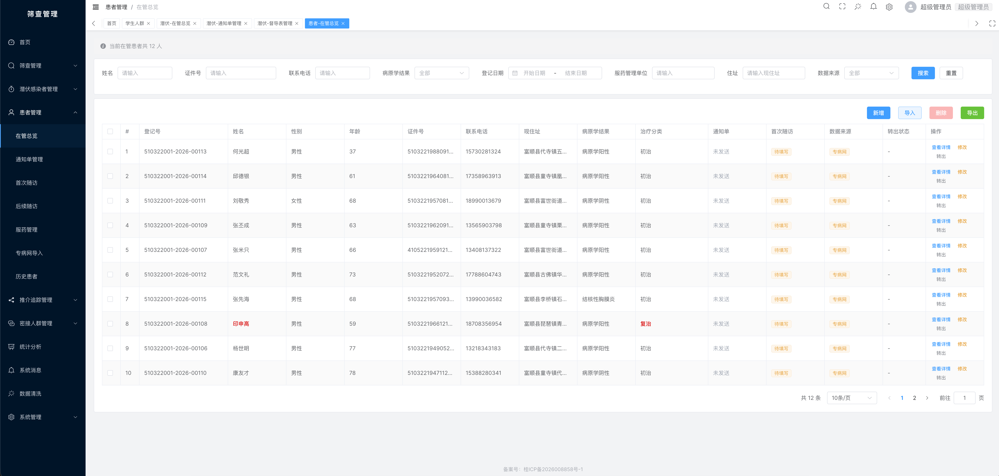
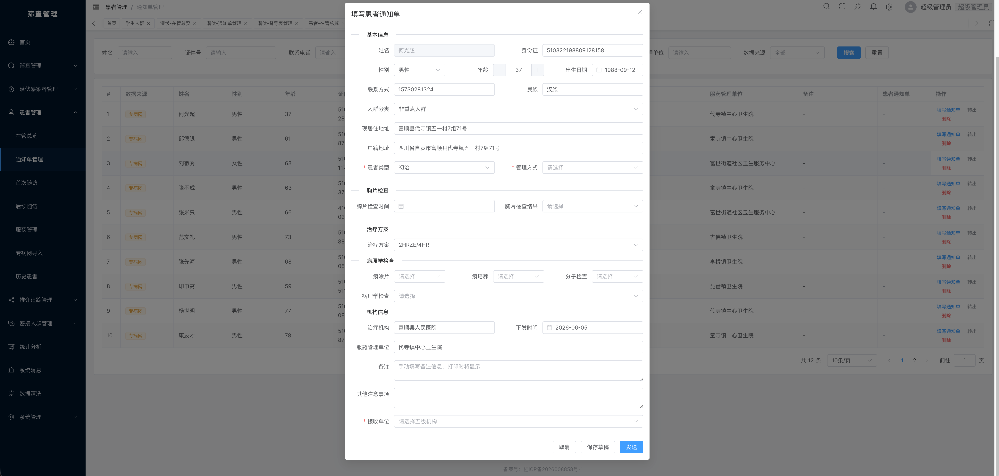
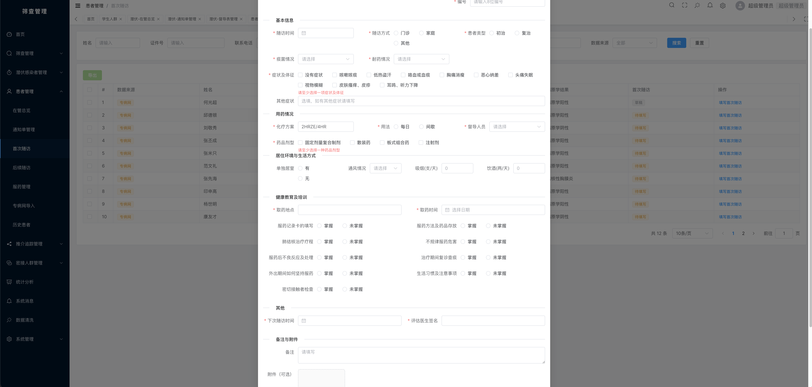
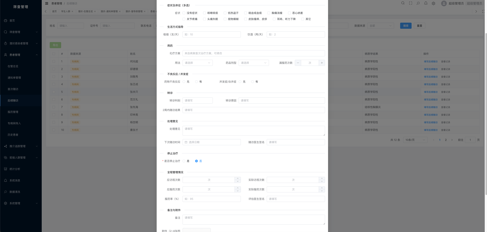
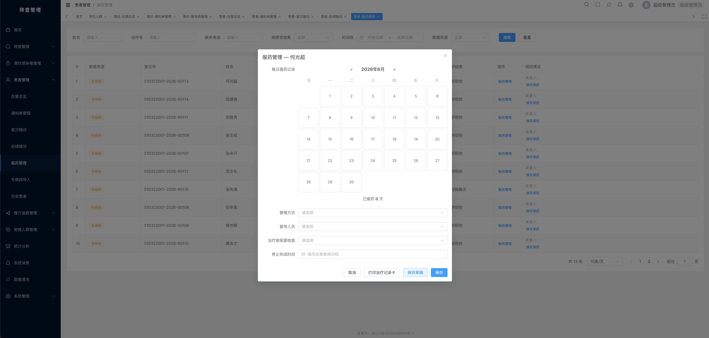
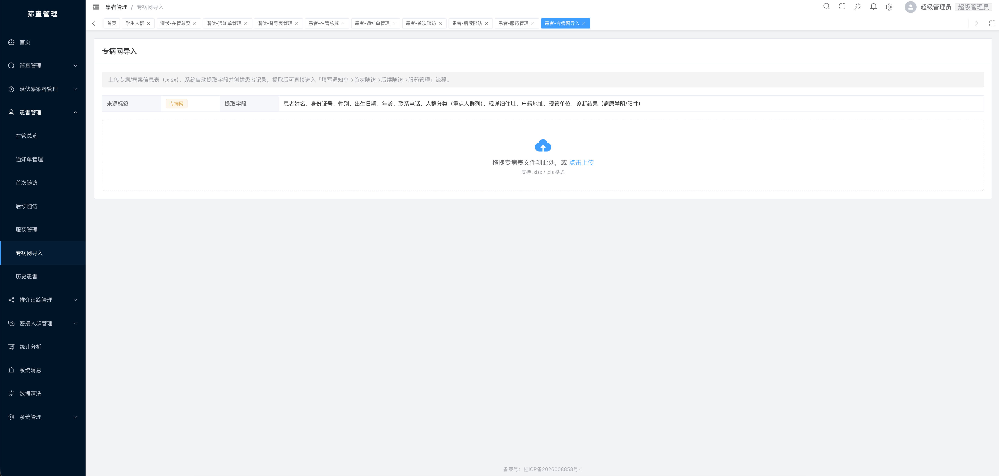

---

### 6.6 密接人群管理

**【做什么】** 密接（密切接触者）人群因业务特殊（**三轮独立筛查**：首次、半年后、一年后），保留为独立管理模块。包含 4 个子菜单：密接个案表、筛查管理、潜伏感染、监测随访。

**【三轮筛查与分流逻辑】** 导入密接个案后，依据**最终筛查结果**进入不同后续流程：

| 最终筛查结果 | 后续去向 |
|---|---|
| 活动性肺结核 | 标红结案（确诊患者进入患者管理） |
| 疑似肺结核 | 标黄结案 |
| 潜伏感染者 | 进入**密接专属潜伏感染流程**（不在聚合潜伏管理中处理） |
| 未做 | 进入 6/12/24 月随访监测 |
| 未发现异常 | 进入 **3 月复查流程** |

> 阳性判定同样基于感染筛查（PPD/EC/IGRA）。三轮中任一轮阳性即判疑似进入追踪；三轮均阴性则归档。

**【各子菜单】**

- **密接个案表**：上传密接个案 Excel 模板、新增/编辑/删除、按"潜伏/确诊"分类导出、查看详情。
- **筛查管理**：维护三轮感染筛查数据，可设置"预计完成治疗时间"、"确认治疗完成"、"3 月复查结果"等。
- **潜伏感染**：密接专属的潜伏感染者管理（与聚合的"潜伏感染者管理"分开处理）。
- **监测随访**：追踪到位后补录信息、开展监测随访。

**【衔接】** 密接中诊断为"活动性肺结核"的确诊患者，会进入**患者管理**（来源标签显示"密接"）；密接中的潜伏感染仍在密接模块内独立管理。

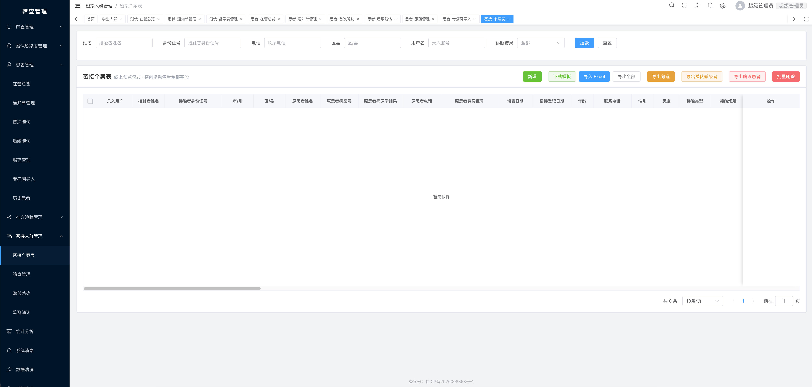

---

### 6.7 推介追踪管理

**【做什么】** 用于**主动录入**待处理对象并驱动诊断流程，含两个子菜单：**推介**（跨单位移交，需对方确认）与**追踪**（直接追踪诊断）。

#### 6.7.1 推介

跨单位把筛查对象移交给三/四/五级用户处理：

1. **新增推介**：手动录入基本信息 + 选择推介接收人（显示"用户名(单位)"）+ 推介原因。
2. 系统向接收人**发送推介通知**（推介状态依次为：未发送 / 已发送 / 已接受 / 已拒绝）。
3. 接收方在本页或"系统消息"中**确认接收**或**拒绝**（填原因）。
4. 确认后**自动转入"追踪"页**继续后续流程；推介发起方记录保留（已办结行变灰只读）。

> 推介页仅管理推介生命周期，**不含**追踪/胸片/诊断按钮。

#### 6.7.2 追踪

对象来源：手动新增 / 大疫情导入 / 推介确认转入。流程：

1. **追踪**（到位/未到位/其他，未到位 3 次强制结束）。
2. **到位**后录入**筛查信息**（感染筛查、胸片）。
3. **录入诊断**分流：

| 诊断 | 流向 |
|---|---|
| 潜伏感染者 | 进入潜伏感染者管理（来源标签显示"推介"） |
| 确诊患者 | 标红结案 |
| 排除/其他 | 归档 |

> 追踪页还支持"**大疫情导入**"：上传大疫情报告卡 Excel，批量创建追踪对象（来源显示为"大疫情"），包含卡片ID、姓名、证件号、病例分类、疾病名称、报告单位、报告卡录入时间等字段。

**【推介 vs 追踪 区别】**

| 维度 | 推介 | 追踪 |
|---|---|---|
| 目的 | 跨单位移交 | 落实到位、诊断 |
| 是否需对方确认 | 需要（发送→确认/拒绝） | 不需要 |
| 后续操作 | 仅推介生命周期 | 追踪→筛查→诊断 |

**【关于"转诊"与"推介"的区别】** 待诊断、潜伏管理、患者管理等页面上的"**转诊**"按钮，用于把业务记录上报给其他医疗机构处理；而"**推介**"是主动录入对象后移交给指定用户。两者是独立的功能，不要混淆。

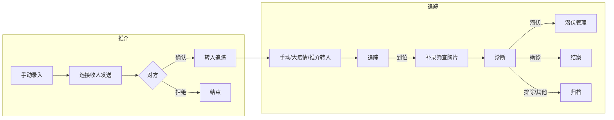
```mermaid
flowchart LR
  subgraph 推介
    A[手动录入] --> B[选接收人发送] --> C{对方}
    C -->|确认| D[转入追踪]
    C -->|拒绝| E[结束]
  end
  subgraph 追踪
    F[手动/大疫情/推介转入] --> G[追踪] -->|到位| H[补录筛查胸片] --> I[诊断]
    I -->|潜伏| J[潜伏管理]
    I -->|确诊| K[结案]
    I -->|排除/其他| L[归档]
  end
  D --> F
```

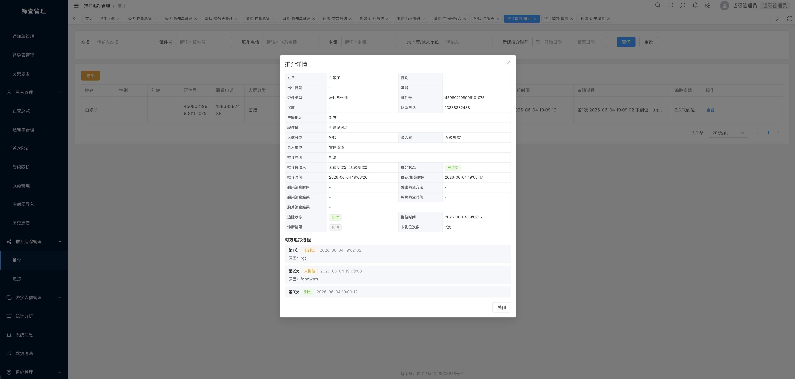
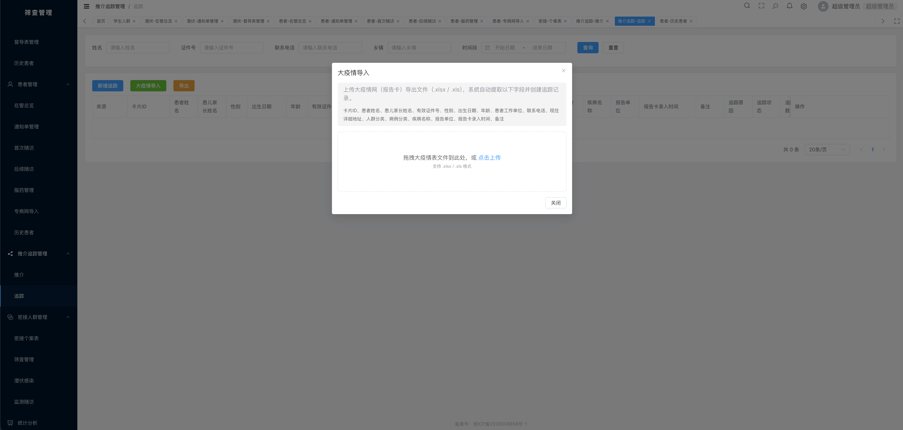

---

### 6.8 系统消息

**【做什么】** 系统的"提醒中心"，把所有需要本人处理或知晓的事件集中呈现，导航栏显示未读角标。

**【三个 Tab】**

1. **收到的消息**：可按全部/未读/已读筛选。消息类型涵盖：待接收通知单、通知单已接收、通知单超时、督导表超时、随访超时、待确认转出/转出已接收/已拒绝、待确认推介/推介已接收/已拒绝。可"查看详情""接收/确认/拒绝""标为已读""删除"。
2. **已发送通知单**：查看自己发出的通知单状态，待接收时可"点击提醒"催促。
3. **已发送转出**：查看自己发起的转诊状态与接收/拒绝结果。

**【主动弹窗提醒】** 系统会定期检查未读消息，对重要事项**弹出居中提醒**（同类提醒只弹一次），优先级从高到低为：待接收通知单 → 通知单超时 → 待确认转出 → 待确认推介 → 督导表超时 → 随访超时 → 复查提醒。点击确认后会跳转到消息中心或对应功能页面。

**【衔接】** 消息由潜伏/患者通知单、转诊、推介以及超时未处理等事项产生，是各模块之间协同工作的"提醒中心"。

📷 【截图：系统消息 → 收到的消息（含未读高亮、超时红色标签）】
📷 【截图：居中弹窗提醒】

---

### 6.9 统计分析

**【做什么】** 提供各类汇总报表与"信息总表"导出，支撑上报与分析。

**【主要 Tab 与功能】**

- **全局筛选**：年份、区县。
- **辖区教育机构统计总表**：按学校统计应筛/实筛/可疑症状/胸片/PPD 各档/EC/IGRA/患者数等，含合计行，可导出 Excel。
- **区县统计表**：按区县维度汇总，可导出 Excel。
- **信息总表导出**：
  - **患者信息总表**（6 类来源 + 专病网）：基本信息+诊断+通知单+随访+服药+归档，可按来源/姓名/证件号/归档状态筛选导出。
  - **潜伏感染者信息总表**（不含密接/专病网）：感染筛查+追踪+通知单+督导+预防性治疗。
- **高级导出**：大汇总表（三类合并）、分类汇总（学校/重点/密接）、自定义字段导出。
- **筛查问卷 Tab**：问卷管理端（见 [6.11](#611-筛查问卷公开填写)）。

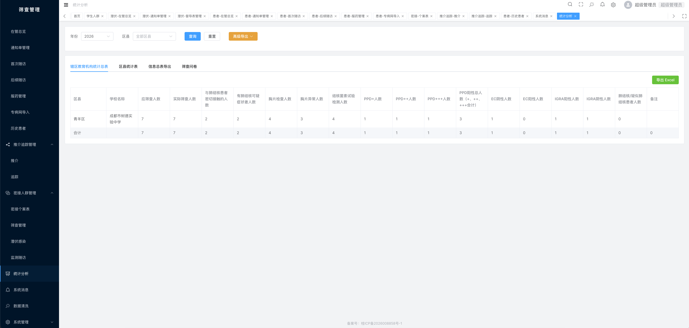
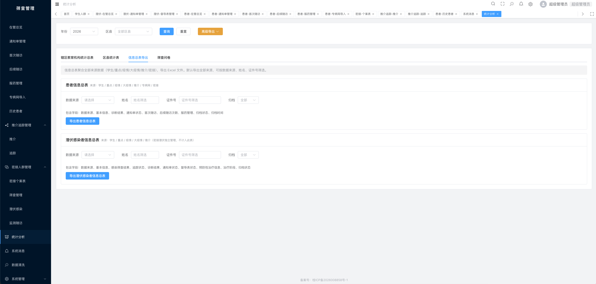

---

### 6.10 数据清洗

**【做什么】** 两件事：① 下载标准**导入模板**；② 上传 Excel 做**异常校验与标黄**，帮助您在导入业务模块前先发现并修正问题。

- **模板下载区**：可下载学生筛查、重点人群、疫情筛查三套标准 Excel 模板。
- **数据清洗区**：选择数据类型（学校/重点/密接）→ 上传 Excel → 点击"开始清洗与验证"（有问题的单元格会标黄，并新增"异常原因"列）→ 点击"下载清洗结果"。页面会显示总行数、异常行数和异常详情。

**【衔接】** 模板用于[筛查管理](#62-筛查管理)的导入；清洗能减少导入报错。

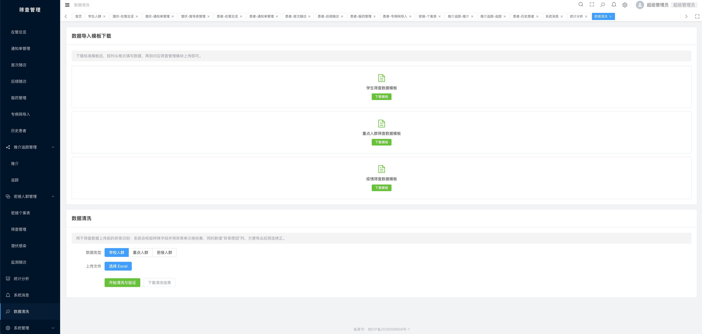

---

### 6.11 筛查问卷（公开填写）

**【做什么】** 一个**无需登录**的公开问卷页面，供被筛查人群扫码或打开链接后自助填写，提交后数据进入筛查统计。

**【填写端（被筛查人使用）】** 按管理员配置的题目逐项填写；部分题目会根据上一题答案自动显示或隐藏；填写出生日期后系统自动计算年龄；身份证、手机号、年龄等会做格式校验。问卷关闭时页面显示"填写已关闭"；提交成功后可点击"重新填写"。

**【管理端（管理员使用）】** 在 **统计分析 → 筛查问卷** 标签页中：可查看填写地址、生成/下载二维码、开启或关闭问卷、编辑标题/说明/题目、查询提交记录并导出 Excel。

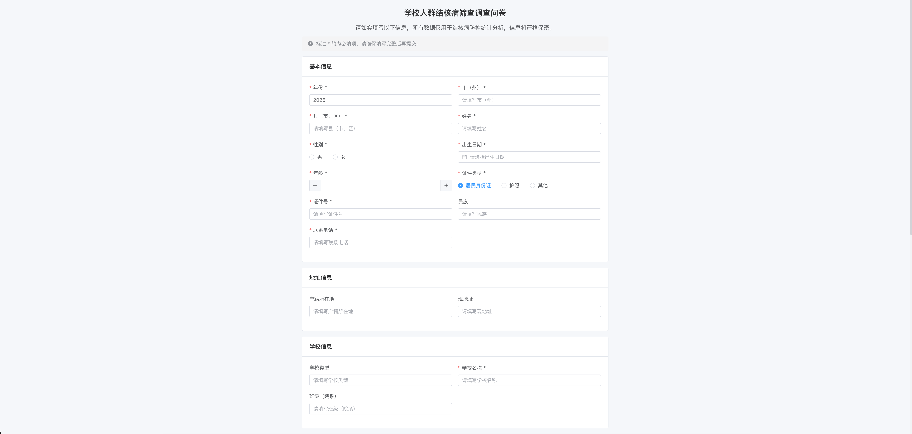
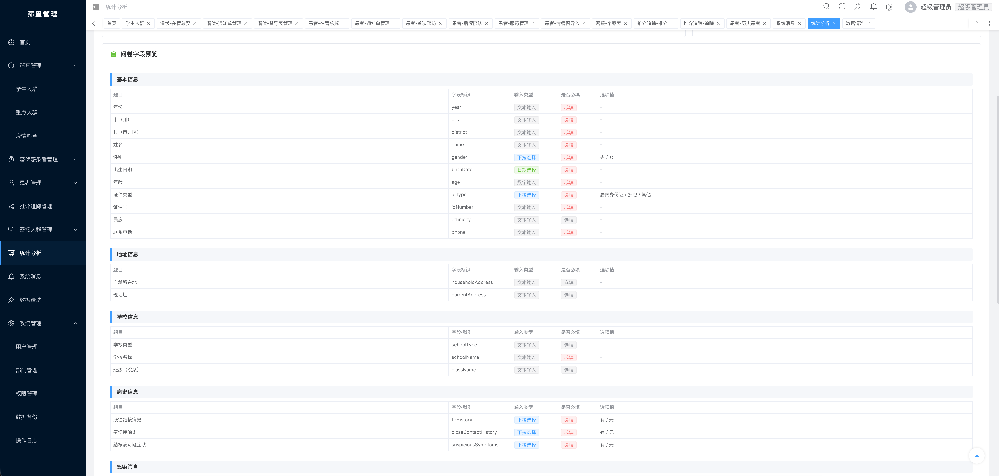

---

### 6.12 系统管理

**【做什么】** 系统运维与权限配置，包含 5 个子菜单，主要由管理员使用。

#### 6.12.1 用户管理

以部门树形结构展示所有用户。可新增、编辑、删除用户（需填写用户名、密码、真实姓名、角色、所属部门、所属机构）；超级管理员账号不可删除。各角色说明见 [4.1](#41-角色层级)。

#### 6.12.2 部门管理（仅超级管理员）

部门分三级：**市级 → 区县 → 社区/街道/乡镇**。可新增、新增下级、编辑、删除，须遵守层级规则（区县的上级必须是市级，社区的上级必须是区县）。

#### 6.12.3 权限管理

- **按角色分配**：选择某个角色，在权限树中勾选该角色可访问的菜单和操作，保存后对该角色下所有用户生效（超级管理员角色不可修改）。
- **按用户追加**：给某个用户单独开通**额外权限**（在其角色权限基础上增加），保存后该用户需**重新登录**才能生效。

#### 6.12.4 数据备份（仅超级管理员）

系统每天凌晨 3 点自动备份数据库，保留最近 30 份。也可点击"立即备份并下载"手动备份，下载得到数据库备份文件。

#### 6.12.5 操作日志

自动记录系统中的关键操作，可按以下 5 类筛选查看和导出：**登录、导入、删除、修改、导出**。还可按业务模块（筛查/潜伏/患者/推介/系统/统计）、操作人、关键词、时间范围（默认近 3 个月）进一步筛选。点击某条记录可查看操作详情。

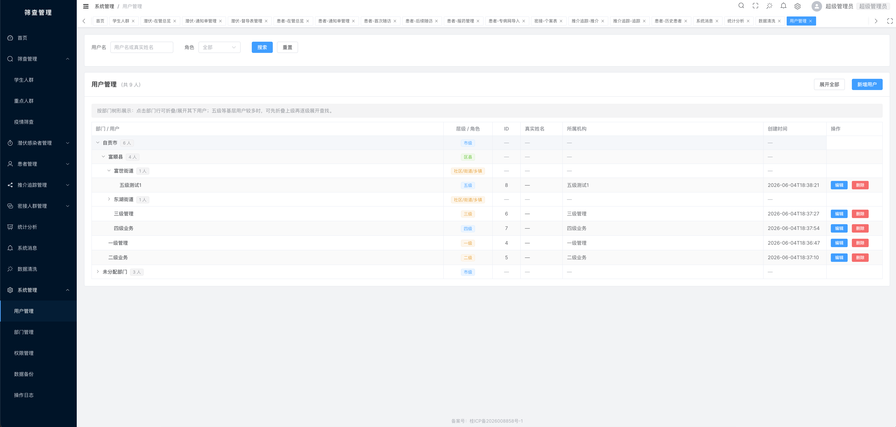
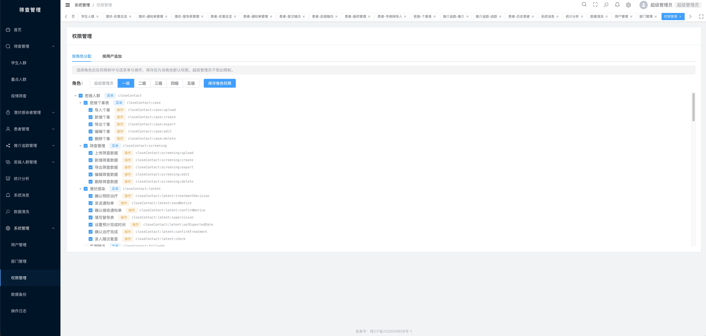
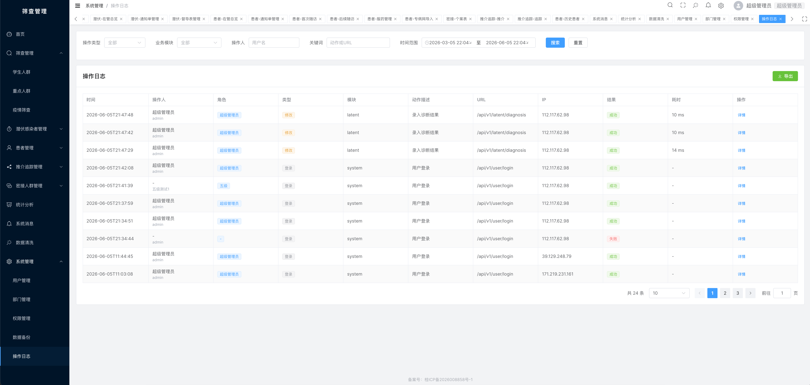

---

## 7. 功能之间的关联关系

本章帮助您理解：做完一步之后，下一步该去哪里、各功能之间如何衔接。

### 7.1 一条数据的"一生"

以一名学生筛查对象为例：

1. **筛查管理 → 学生人群**：导入 Excel，系统按阳性五项自动判定，阳性者进入待诊断。
2. **待诊断**：该生进入待诊断列表，操作员**追踪**到位。
3. 录入**胸片** → 录入**确认诊断**。
4. 分流：
   - 诊断"潜伏感染者" → 进入 **潜伏感染者管理**：下发**通知单** →（基层确认）→ 填**督导表** → 预防性治疗结束 → **归档/历史**。
   - 诊断"确诊患者" → 进入 **患者管理**：下发**患者通知单** →（确认）→ **首次随访** → **后续随访(多次)** → **服药管理/领药** → 治疗结束 → **归档/历史**。
5. 全过程任意阶段可发起**转诊**；产生的待办经**系统消息**提醒相关人。
6. 数据沉淀后在**统计分析**中导出报表；所有关键操作记入**操作日志**。

### 7.2 模块依赖关系图

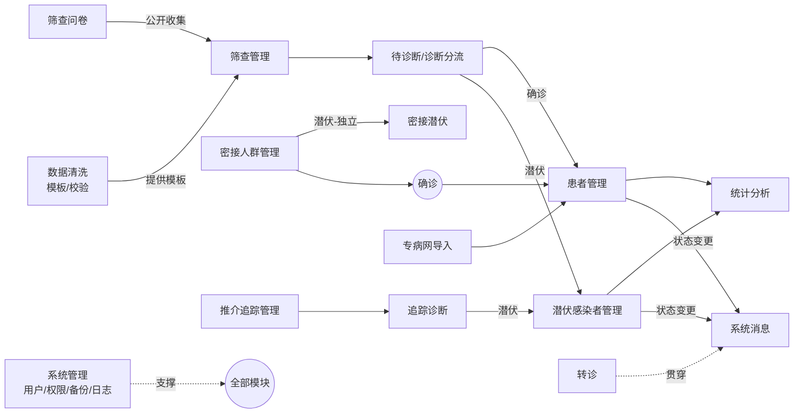
```mermaid
flowchart LR
  DC["数据清洗<br/>模板/校验"] -->|提供模板| SCR[筛查管理]
  Q[筛查问卷] -->|公开收集| SCR
  SCR --> SUS["待诊断/诊断分流"]
  CC[密接人群管理] --> PATp(("确诊"))
  RT[推介追踪管理] --> SUS2[追踪诊断]
  SP[专病网导入] --> PAT

  SUS -->|潜伏| LAT[潜伏感染者管理]
  SUS -->|确诊| PAT[患者管理]
  SUS2 -->|潜伏| LAT
  CC -->|潜伏-独立| CCL[密接潜伏]
  PATp --> PAT

  LAT -->|状态变更| MSG[系统消息]
  PAT -->|状态变更| MSG
  REF[转诊] -.贯穿.-> MSG
  LAT --> STAT[统计分析]
  PAT --> STAT
  SYS["系统管理<br/>用户/权限/备份/日志"] -.支撑.-> ALL(("全部模块"))
```

### 7.3 关键"连接点"汇总

| 连接点 | 上游 | 下游 | 触发条件 |
|---|---|---|---|
| 阳性判定 | 筛查导入 | 待诊断列表 | 感染筛查命中阳性五项 |
| 诊断分流 | 待诊断/推介追踪 | 潜伏管理 / 患者管理 | 录入确认诊断 |
| 密接确诊汇入 | 密接筛查 | 患者管理 | 最终筛查=活动性肺结核 |
| 专病网导入 | 专病表 Excel | 患者管理 | 上传解析 |
| 推介转入 | 推介确认 | 追踪页 | 接收方确认接收 |
| 通知单确认 | 通知单管理 | 督导表/首次随访 | 接收方(五级)确认 |
| 超时提醒 | 通知单/督导/随访 | 系统消息 | 48h/72h 未处理 |
| 归档 | 督导/后续随访/服药 | 历史患者 | 治疗结束/停止治疗 |

---

## 8. 附录

### 8.1 常用状态说明

日常操作中，您会在列表和弹窗里看到以下状态，含义如下：

**追踪状态**

| 状态 | 含义 |
|---|---|
| 待追踪 | 尚未联系对象 |
| 到位 | 已联系到，可继续胸片检查和诊断 |
| 未到位 | 本次未联系到，需再次追踪 |
| 其他 | 特殊情况，需备注原因 |
| 强制结束 | 未到位满 3 次后系统自动结束 |

**通知单状态**

| 状态 | 含义 |
|---|---|
| 未发送 | 尚未发出 |
| 草稿 | 已填写但未发送，可继续编辑 |
| 已发送 | 已发出，等待接收方确认 |
| 已确认 | 接收方已确认接收 |

**推介状态**

| 状态 | 含义 |
|---|---|
| 未发送 | 尚未发出推介 |
| 已发送 | 已发出，等待对方确认 |
| 已接受 | 对方已确认接收 |
| 已拒绝 | 对方已拒绝接收 |

**密接筛查后续去向**

| 最终筛查结果 | 含义 |
|---|---|
| 活动性肺结核 | 确诊，进入患者管理 |
| 疑似肺结核 | 标黄结案 |
| 潜伏感染者 | 进入密接专属潜伏感染流程 |
| 未做 | 进入 6/12/24 月随访监测 |
| 未发现异常 | 进入 3 月复查流程 |

**治疗阶段（潜伏感染者）**

| 阶段 | 含义 |
|---|---|
| 未开始 | 尚未开始预防性治疗 |
| 预防治疗中 | 正在接受治疗 |
| 已结案 | 治疗已结束并归档 |

### 8.2 自动提醒规则

系统会在以下情况自动发送消息提醒（无需人工设置）：

| 提醒事项 | 触发条件 | 提醒对象 |
|---|---|---|
| 通知单超时 | 通知单发出后 **48 小时**仍未确认 | 发送方和接收方 |
| 督导表超时 | 潜伏通知单确认后 **72 小时**仍未填写督导表 | 接收方 |
| 随访超时 | 首次或后续随访逾期未填写 | 相关工作人员 |
| 密接复查提醒 | 密接对象到达复查时间节点 | 相关工作人员 |
| 数据库自动备份 | 每天凌晨 **3 点**自动执行 | 管理员可在"数据备份"中查看和下载 |

### 8.3 操作日志记录范围

管理员可在 **系统管理 → 操作日志** 中查看以下类型的操作记录：

| 操作类型 | 记录内容举例 |
|---|---|
| 登录 | 用户登录成功或失败 |
| 导入 | 上传 Excel 导入筛查、患者等数据 |
| 删除 | 删除筛查记录、患者记录等 |
| 修改 | 修改诊断结果、追踪状态、通知单、随访表、服药记录等 |
| 导出 | 导出统计报表、信息总表、操作日志等 |

---

## 9. 项目部署

> 本项目为**前后端分离 + MySQL** 三件套，已提供完整的 Docker 化方案（根目录 `docker-compose.yml`）。生产环境**推荐使用 Docker Compose 一键部署**；也支持手动分别部署。

### 9.1 部署架构与组件

| 组件 | 技术 | 容器名 | 默认端口 | 镜像/构建 |
|---|---|---|---|---|
| 前端 | Vue3 构建产物 + Nginx | `disease_frontend` | `80` | 根目录 `Dockerfile`（多阶段：node 构建 → nginx 托管） |
| 后端 | Spring Boot（JDK17） | `disease_backend` | `9652`（映射） | `admin/Dockerfile`（多阶段：maven 打包 → jre 运行） |
| 数据库 | MySQL 8.0 | `disease_mysql` | `3306` | 官方 `mysql:8.0` 镜像 |

请求链路：

```
浏览器 → Nginx(80)
            ├─ 静态资源 /            → /usr/share/nginx/html（前端 SPA，history 兜底到 index.html）
            └─ 接口 /api/v1/*        → 反向代理 → 后端 backend:9652
                                                        └─ JDBC → mysql:3306/disease_monitor
```

> 前端环境变量 `VITE_BASE_URL = /api/v1`，与 Nginx 的 `location /api/v1`、后端 `context-path: /api/v1` 三者对齐。

### 9.2 方式一：Docker Compose 一键部署（推荐）

**前置要求**：宿主机已安装 Docker 与 Docker Compose（Docker Desktop 或 Docker Engine + compose 插件）。

**步骤**：

```bash
# 1. 进入项目根目录（含 docker-compose.yml）
cd v3-admin-vite-main

# 2. 修改 docker-compose.yml 中的敏感配置（务必！见 9.4）
#    - MYSQL_ROOT_PASSWORD / MYSQL_PASSWORD：数据库密码
#    - JWT_SECRET：随机长字符串（≥32 字符）

# 3. 构建并后台启动全部服务（首次会自动构建前后端镜像）
docker compose up -d --build

# 4. 查看运行状态与日志
docker compose ps
docker compose logs -f backend
```

**初始化说明**：

- MySQL 首次启动会自动执行 `admin/src/main/resources/init.sql` 完成**建库建表与初始数据**（挂载到 `/docker-entrypoint-initdb.d/`）。
- 数据通过命名卷持久化：`mysql_data`（数据库）、`backend_uploads`（上传文件）、`backend_backups`（备份文件）。

**访问**：浏览器打开 `http://<服务器IP>/` 即可进入登录页。

**停止 / 重启**：

```bash
docker compose stop          # 停止（保留数据）
docker compose down          # 停止并删除容器（卷数据保留）
docker compose down -v       # ⚠️ 连同数据卷一起删除（清空数据库，慎用）
```

### 9.3 方式二：手动部署

适用于不使用 Docker 的服务器。

**① 数据库（MySQL 8.0）**

```sql
CREATE DATABASE disease_monitor DEFAULT CHARACTER SET utf8mb4;
-- 创建用户并授权，然后导入初始化脚本
SOURCE admin/src/main/resources/init.sql;
```

**② 后端（需 JDK 17 + Maven 3.9）**

```bash
cd admin
mvn clean package -DskipTests
# 运行（通过环境变量或参数覆盖数据库地址、密钥、端口）
java -jar target/*.jar \
  --spring.datasource.url="jdbc:mysql://127.0.0.1:3306/disease_monitor?useUnicode=true&characterEncoding=utf-8&useSSL=false&serverTimezone=Asia/Shanghai&allowPublicKeyRetrieval=true" \
  --spring.datasource.username=disease_monitor \
  --spring.datasource.password=你的密码 \
  --jwt.secret=你的随机密钥
```

> 后端备份功能依赖 `mysqldump` 命令行工具，手动部署时需确保服务器已安装 MySQL 客户端。
> 上传/备份文件默认存放在运行目录下的 `./data/uploads`、`./backups`（见 `application.yml` 的 `app.upload.dir`）。

**③ 前端（需 Node 22 + pnpm）**

```bash
pnpm install --frozen-lockfile
pnpm build                   # 产物输出到 dist/
```

将 `dist/` 部署到 Nginx，并参考 `docker/nginx.conf` 配置：SPA history 兜底 + `/api/v1` 反向代理到后端地址。

> 预发布环境可用 `pnpm build:staging`；本地开发用 `pnpm dev`（默认 Vite 开发服务器，通过代理访问后端）。

### 9.4 关键配置项说明

| 配置 | 位置 | 说明 |
|---|---|---|
| `MYSQL_ROOT_PASSWORD` / `MYSQL_PASSWORD` | `docker-compose.yml` | **部署前必须改**为强密码 |
| `JWT_SECRET` | `docker-compose.yml` / 后端环境变量 | **部署前必须改**为随机长字符串（≥32 字符），否则存在安全风险 |
| `SPRING_DATASOURCE_URL/USERNAME/PASSWORD` | `docker-compose.yml`（覆盖 `application-prod.yaml`） | 指向 MySQL；Docker 内用容器名 `mysql` 作为主机 |
| `VITE_APP_TITLE` | `.env` | 站点标题（当前为"筛查管理"） |
| `VITE_ROUTER_HISTORY` | `.env` | 路由模式（当前 `hash`） |
| `VITE_BASE_URL` | `.env.production` | 后端接口前缀 `/api/v1` |
| `context-path` / `server.port` | `application-prod.yaml` | 后端上下文 `/api/v1`、端口（如调整，需同步 compose 端口映射与 `nginx.conf` 的 `proxy_pass`） |
| 文件大小上限 | `nginx.conf`(`client_max_body_size 25m`)、`application-prod.yaml`(`multipart`) | 上传/导入文件大小限制 |

> ⚠️ **端口一致性提示**：若修改后端端口，务必让 `docker-compose.yml` 端口映射、`docker/nginx.conf` 的 `proxy_pass http://backend:9652` 与后端实际监听端口三者保持一致。

### 9.5 升级、备份与常见问题

**代码升级重新部署**：

```bash
git pull
docker compose up -d --build        # 重新构建并滚动更新
```

**数据库备份**：

- 系统内置每日 03:00 自动备份（保留最近 30 份），管理员可在"系统管理 → 数据备份"手动备份并下载。
- Docker 卷级备份：`docker run --rm -v <项目>_mysql_data:/data -v $(pwd):/backup alpine tar czf /backup/mysql_data.tar.gz /data`。

**常见问题排查**：

| 现象 | 排查方向 |
|---|---|
| 前端能打开但接口 404/502 | 检查 Nginx `proxy_pass` 与后端端口、后端容器是否健康（`docker compose logs backend`） |
| 后端启动失败 | 检查数据库连接（地址/账号/密码）、MySQL 是否就绪（compose 已配 `healthcheck` 等待） |
| 登录后立即退回登录页 | 检查 `JWT_SECRET` 是否配置、前后端时间是否同步 |
| 上传/导入大文件失败 | 调大 `nginx.conf` 的 `client_max_body_size` 与后端 `multipart` 上限 |
| 数据库中文乱码 | 确认库与连接均为 `utf8mb4` / `characterEncoding=utf-8` |
